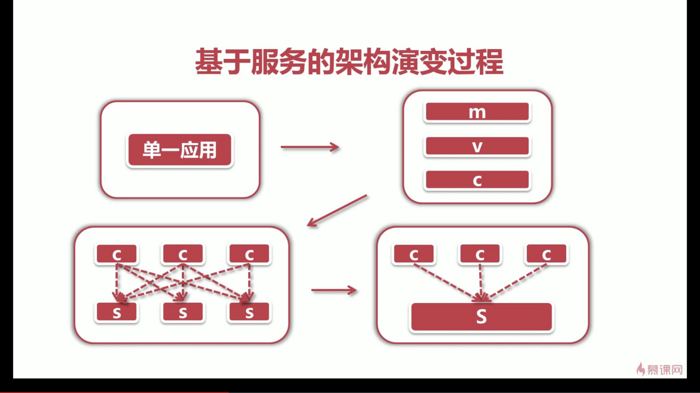
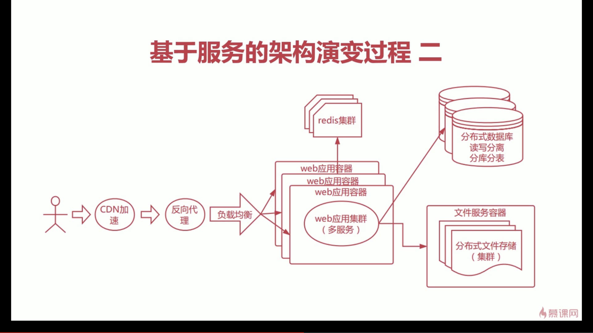
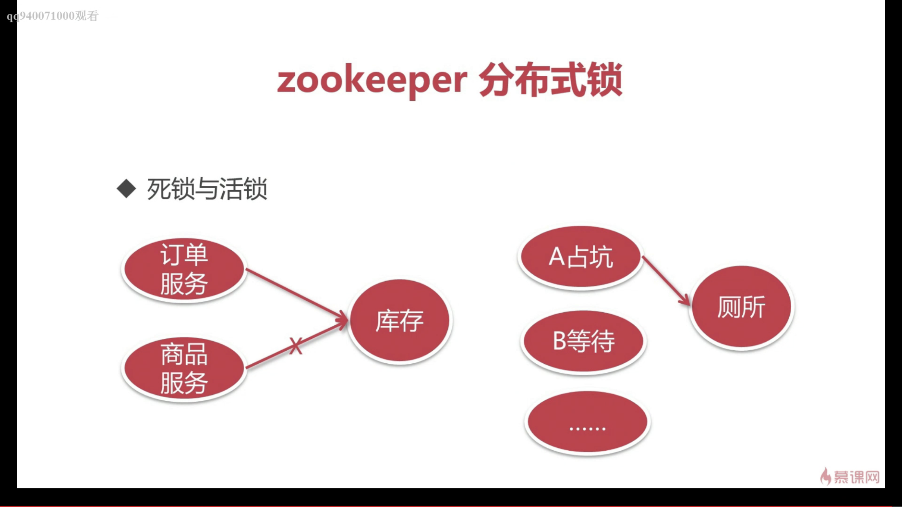
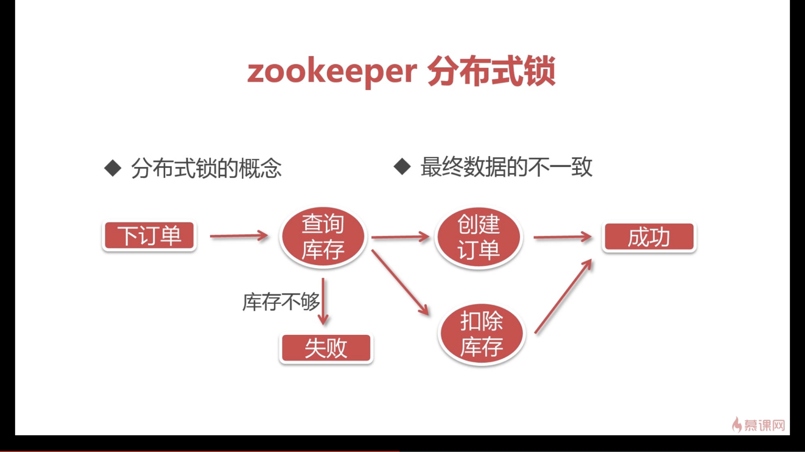

# zk-dubbo

## 8 Dubbo入门到重构服务
[返回主目录](../README.md)

### 8.1 架构演变过程



### 8.2 系统之间的调用方式
    废弃（很老）：Webservice-wsdl
    过渡（普通）：httpclient
    现在（现状）：rpc通信（Dubbo）、restful(Springcloud)

### 8.3 实际应用
    分布式协调服务dubbo
    分布式锁

### 8.3.1 dubbo简介
    最大程度进行解耦，降低系统耦合性
    生产者/消费者模式
    zk注册中心，admin监控中心，协议支持
    
### 8.3.2 配置文件
```xml
<?xml version="1.0" encoding="UTF-8"?>
<beans xmlns="http://www.springframework.org/schema/beans"
	xmlns:xsi="http://www.w3.org/2001/XMLSchema-instance"
	xmlns:dubbo="http://code.alibabatech.com/schema/dubbo"
	xsi:schemaLocation="http://www.springframework.org/schema/beans http://www.springframework.org/schema/beans/spring-beans-4.2.xsd
	http://code.alibabatech.com/schema/dubbo http://code.alibabatech.com/schema/dubbo/dubbo.xsd">
		
	<!-- 为当前服务提供者取个名字，并且提供给注册中心 -->
	<dubbo:application name="imooc-dubbo-item-service"></dubbo:application>
	
	<!-- 注册中心的配置，使用zk暴露服务 -->
	<dubbo:registry protocol="zookeeper" address="localhost:2181"></dubbo:registry>
	
	<!-- 定义暴露服务的端口号 -->
	<dubbo:protocol name="dubbo" port="20880"></dubbo:protocol>
	
	<!-- 暴露具体的服务接口 -->
	<dubbo:service retries="3" interface="com.imooc.item.service.ItemsService" 
		ref="itemsService"></dubbo:service>
	
</beans>
```

### 8.3.3 启动方式

#### 1. Tomcat容器内启动（略）

#### 2. Main主线程运行
```java
    package com.imooc.item.starter;
    
    import org.springframework.context.support.ClassPathXmlApplicationContext;
    
    public class ItemApplication {
    
    	public static void main(String[] args) throws Exception {
    		ClassPathXmlApplicationContext context = new ClassPathXmlApplicationContext(
                    new String[] {"classpath:spring/spring-context.xml"});
            context.start();
            // press any key to exit
            System.in.read();
    	}
    
    }
```
####  3. 通过Dubbo内置Main打成jar包运行
```xml
<plugins>
    <plugin>
        <groupId>org.apache.maven.plugins</groupId>
        <artifactId>maven-jar-plugin</artifactId>
        <configuration>
            <classesDirectory>target/classes/</classesDirectory>
            <archive>
                <manifest>
                    <mainClass>com.alibaba.dubbo.container.Main</mainClass>
                    <useUniqueVersions>false</useUniqueVersions>
                    <addClasspath>true</addClasspath>
                    <classpathPrefix>lib/</classpathPrefix>
                </manifest>
                <manifestEntries>
                    <Class-Path>.</Class-Path>
                </manifestEntries>
            </archive>
        </configuration>
    </plugin>
    <plugin>
        <groupId>org.apache.maven.plugins</groupId>
        <artifactId>maven-dependency-plugin</artifactId>
        <executions>
            <execution>
                <id>copy-dependencies</id>
                <phase>package</phase>
                <goals>
                    <goal>copy-dependencies</goal>
                </goals>
                <configuration>
                    <type>jar</type>
                    <includeTypes>jar</includeTypes>
                    <useUniqueVersions>false</useUniqueVersions>
                    <outputDirectory>
                        ${project.build.directory}/lib
                    </outputDirectory>
                </configuration>
            </execution>
        </executions>
    </plugin>
</plugins>
```

### 8.4 zookeeper分布式锁

